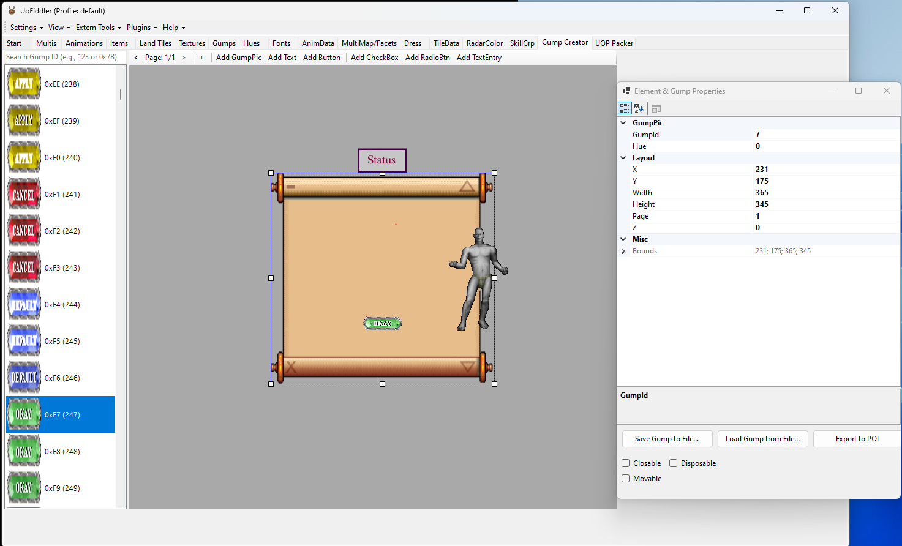

# UOFiddler

This is a fork of [UOFiddler](https://github.com/polserver/UOFiddler).

## Gump Creator Plugin
This fork includes a powerful Gump Creator plugin.

### Features
- Gump visualization
- Drag and drop gump creation
- Gump object properties editing
- Exporting gump to POL
- Hotkeys (Copy, Paste, Ctrl + Arrow for moving elements, Delete, etc.)
- Resizing elements
- Exporting gump to file and load it later

If you like this plugin, you can [buy me a coffee](https://coff.ee/elanon).

## About

UOFiddler based on Ultima SDK it's a tool to view and alter almost every UO 2D client file. Source code is released under the Beerware license.

We have dedicated channel on POL Discord: https://discord.gg/4JbC8hA

## Requirements

Starting from version 4.11.0:

- Requires .NET Desktop Runtime 8.0.x (or SDK) installed to run the application.
- You can download .NET 8.0 at: <https://dotnet.microsoft.com/en-us/download/dotnet/8.0>
- Minimum supported Windows version is Windows 10.

Versions between 4.10.0 and 4.10.9

- Requires .NET Desktop Runtime 7.0.x (or SDK) installed to run the application.
- You can download .NET 7.0 at: <https://dotnet.microsoft.com/en-us/download/dotnet/7.0>
- Minimum supported Windows version is Windows 10.

Older versions, 4.9.28 and lower use .Net Framework 4.8

## Building

You'll need Visual Studio 2022 v17.10 or newer, .NET 8.0 and .NET desktop development workload.

Build the project in the same way as you would for the original UOFiddler.

## Running

To run the application, use the executable version located in `UoFiddler/bin/Release/` directory.

## Reporting bugs and issues

Please report any bugs or issues here: [issues](https://github.com/polserver/UOFiddler/issues).
